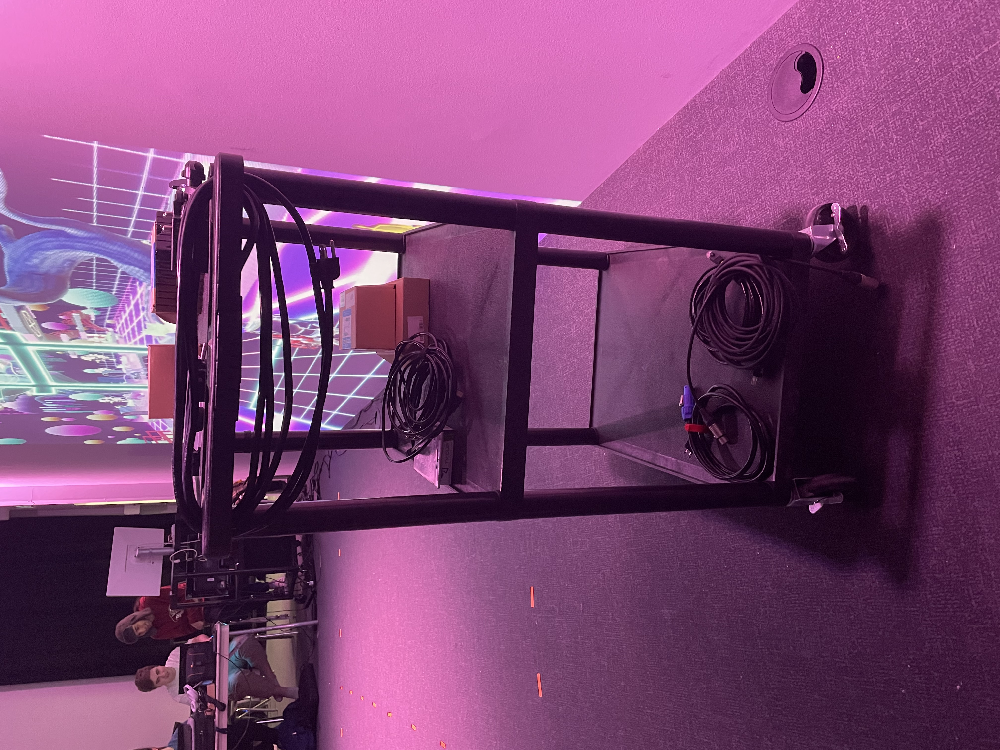

# fiche de présentation de l'oeuvre retenue.

## Composantes et techniques.
Pour toutes les composantes sur la liste, on aurais :

### Audio
1 Console de sons
1 Carte de sons
2 Haut-parleurs Genelec 8010APM
4 Câbles XLR (M->F) (Longueur minimale estimée entre 4-6 mètres)
### Vidéo
1 Projecteur
1 Kinect V2
1 sytème d'acrochage pour le projecteur
### Électricité
2 Cordon IEC (pour alimenter les haut-parleurs)
2 Multiprise
2 Extensions de fils électrique (Longueur minimale estimée entre 6-8 mètres)
1 Câble d’alimentation pour ordinateur
1 Câble d’alimentation pour console de son
### Réseau
2 Fils Ethernet (longueur minimale estimée entre 4-8 mètres)
1 HDMI Extender
2 Câbles HDMI
Câble displayPort
### Ordinateur
1 Chariot Ordinateur
### Autres
Tapis de protection
3 Safety en métal
1 Powercon
1 Magic Arm

  Pour les techniques, les voici :

  - savoir faire pour l'instalation des compostants
  - savoir faire pour le code de ceux-ci
  - savoir faire pour lier les composants et le code
  - savoir faire pour le bon foctionement de l'oeuvre

## Mise en espace.
Cette oeuvre est positionée a l'entrée du grand studio du College Montmorency. L'oeuvre est tout de suite a notre gauche, du moment auquel on entre dans le grand studio. Sur le mur de gauche, s'y retrouve la projection du jeux sur le mur, grace au projecteur directement en face de celui-ci. Nous avons des délimitations en forme de carrés par terre pour nous indiquer quelles sont les limites du capteur de mouvements.

## Fonction du dispositif multimédia.
La fonction de ce dispositif est d'offrir une experience interresante et basée entierement sur l'interractivité. Plonger l'utilisateur dans un type de deux tres different que d'habitude. On sais tous que les jeux videos sont jouables sur des manettes et clavier et sourie, mais qu'en est t'il du capteur de mouvements ? Cette question, on tempte d'y repondre avec ce dispositif. 

## Type d'installation.
Le type d'instalation, c'est interractif, car le but de cette oeuvre est de jouer au jeux deja fait et de tester l'interactivité d'un dispositif en utilisant des capteurs de mouvements et un personage relié a celui-ci.

## Description de l'oeuvre ou du dispositif.
L'oeuvre est tres similaire au jeux " Just Dance " , cet a dire ; Il y a un capteur de mouvements qui traque tout les mouvements de votre corps. Celui-ci transmet l'information a l'ordinateur. L'ordinateur fait ensuite bouger un personage sur la projection du projecteur, et cela par rapport a vos mouvements. Il y a des murs qui avancent et le but du jeux est simple ; de bouger et d'éviter les murs qui bougent. Le score monte et le but est de faire le plus haut score possible. Les murs qui bougent deviennent plus vite plus le temp passe. Il y a des speakers qui projettent le son du jeux. Aussi, il  a des délimitations par terre indiquant a l'utilisateur la zone qui est detectée par le capteur de mouvements.

## Éléments nécessaires à la mise en exposition.
Voici une liste de chaque éléments nécessaires à la mise en exposition ( les éléments monté ) :

- les cables
- le projecteur
- le ou les ordinateurs portables
- des speakers
- capteurs de mouvements

## Experience vécue
ce qui serait attendu d'un utilisayeur, c'est tout simplement de s'amuser! Et oui, cette oeuvre est entierement dépendante sur l'interractivité, et ce n'est pas mauvais du tout. On essaie, comme dans un jeux vidéo, de faire le score le plus haut en esquivant les obstacles. L'experience pendant la partie constitue la magie de l'oeuvre. Personellement, je suis arrivé a l'exposition et c'est la premiere oeuvre que j'ai essayer car elle saute vraiment aux yeux.

## Ce qui m'a plu
Personellement, je trouve que l'entieretée de l'oeuvre était non seulement agréable, mais tout aussi impressionante. L'interractivité fesait déja une grande partie. La détection des mouvements était limité, cependant pour ue équipe étudiante, c'est extremement bien. Le systeme me r'apellais du jeux «Just Dance» et c'est une positif. Par allieur, je pense que lùtilisation etait tres intuitive. Il y avait une délimitation par terre et des qu'on rentre dedans, notre personnage apparait.

## Ce que je changerais
Je pense que pour ce que je changerais, ce serait plutot un ajout. Un mode de jeux different ou il faudrait passer a travers des formes. Un peu comme l`'émission «Sa passe ou sa casse». Sa r'ajouterais tout une autre dimension a l'oeuvre : non seulement d'amusement, mais aussi de potentiel. Ce que le monde interpreterais serait difféerent avec plusieurs mode de jeux. A une seule, le monde pensent que c'est seulement un prototype, mais a deux, les gens le percoivent directement comme un véritable jeux vidéo.

